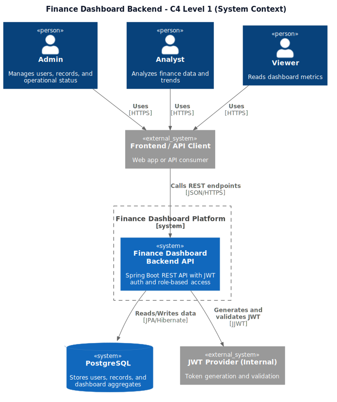
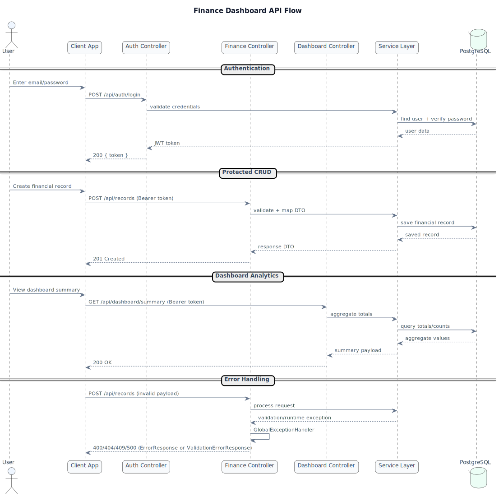
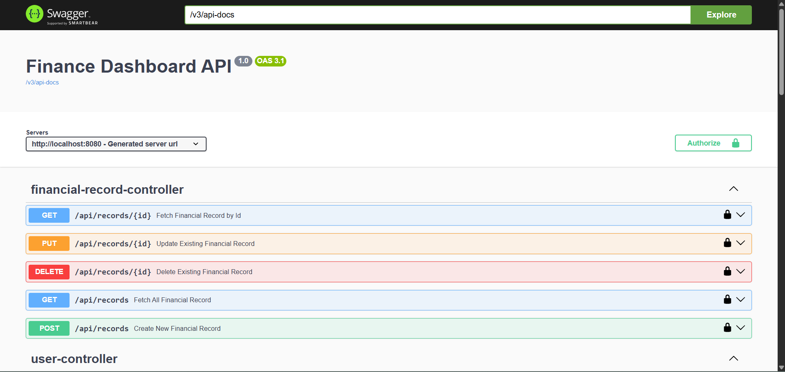

# Finance Dashboard Backend

Finance Dashboard Backend is a Spring Boot REST API for managing users, financial records, authentication, and dashboard summaries with JWT-based access control.

---

## Technology Highlights

<p align="left">
  
  
  
  
</p>

---

## Features

- JWT authentication and authorization
- User management APIs
- Financial record CRUD APIs
- Soft delete for financial records
- Role-based access control
- Dashboard and summary APIs
- Pagination support for records listing
- Query parameter based filtering/slicing for dashboard analytics
- Swagger/OpenAPI documentation
- Dockerized deployment
- Unit tests with JUnit 5 and Mockito

---

## Tech Stack

- Java 21
- Spring Boot
- Spring Security
- JWT (JJWT)
- PostgreSQL
- Spring Data JPA / Hibernate
- Maven
- Swagger / OpenAPI (springdoc)
- Docker + Docker Compose
- JUnit 5 + Mockito

---

## Project Structure

```text
src
├── main
│   └── java
│       └── com/aakil/finance_dashboard_backend
│           ├── auth
│           ├── config
│           ├── dashboard
│           ├── finance
│           ├── user
│           └── common
└── test
```

Inside each module, code is organized by:

- controller
- service
- repository
- dto
- entity

---

## API Modules

- /api/auth
  - Authentication endpoints (login and token generation)
- /api/users
  - User lifecycle management (create, fetch, activate, deactivate)
- /api/records
  - Financial record operations (create, list with pagination, update, soft delete)
- /api/dashboard
  - Aggregations, summaries, trend analytics, and admin status

---

## Authentication

- POST /api/auth/login returns a JWT token.
- Send token in request header:

```http
Authorization: Bearer <token>
```

- Public endpoints:
  - /api/auth/**
  - /v3/api-docs/**
  - /swagger-ui/**
  - /swagger-ui.html
- All other endpoints require authentication.

---

## Roles and Permissions

| Role | Permissions |
|------|-------------|
| ADMIN | Manage users, records, and dashboard |
| ANALYST | View records and dashboard |
| VIEWER | View dashboard only |

---

## API Endpoints (Complete)

### Auth

- POST /api/auth/login

### Users

- GET /api/users
- POST /api/users
- GET /api/users/{id}
- POST /api/users/{id}/activate
- POST /api/users/{id}/deactivate

### Financial Records

- GET /api/records?page=0&size=10
- POST /api/records
- GET /api/records/{id}
- PUT /api/records/{id}
- DELETE /api/records/{id}

### Dashboard

- GET /api/dashboard/summary
- GET /api/dashboard/status
- GET /api/dashboard/monthly-summary?year=2026&month=4
- GET /api/dashboard/trend?from=2026-04-01&to=2026-04-30
- GET /api/dashboard/category-breakdown?type=INCOME
- GET /api/dashboard/recent-records?limit=10
- GET /api/dashboard/top-income?limit=5
- GET /api/dashboard/top-expenses?limit=5
- GET /api/dashboard/user-summary/{userId}
- GET /api/dashboard/record-count-by-type
- GET /api/dashboard/record-count-by-user

---

## Sample Request / Response

### Login

```http
POST /api/auth/login
Content-Type: application/json

{
  "email": "admin@example.com",
  "password": "password123"
}
```

```json
{
  "token": "eyJhbGciOiJIUzI1NiJ9..."
}
```

### Create Financial Record

```http
POST /api/records
Authorization: Bearer <token>
Content-Type: application/json

{
  "amount": 1500.00,
  "type": "INCOME",
  "category": "Salary",
  "description": "Monthly salary",
  "transactionDate": "2026-04-01",
  "createdByUserId": 1
}
```

```json
{
  "id": 101,
  "amount": 1500.00,
  "type": "INCOME",
  "category": "Salary",
  "description": "Monthly salary",
  "transactionDate": "2026-04-01",
  "createdById": 1,
  "createdByName": "Admin User",
  "createdAt": "2026-04-01T10:15:30",
  "updatedAt": "2026-04-01T10:15:30"
}
```

---

## Running Locally

### Prerequisites

- Java 21
- Maven (or use ./mvnw)
- PostgreSQL

### Configure Database

By default, the application expects a PostgreSQL database named finance_dashboard on localhost:5432.

### Build and Run

```bash
./mvnw clean install
./mvnw spring-boot:run
```

Application base URL:

- http://localhost:8080

---

## Swagger Documentation

Swagger UI:

- http://localhost:8080/swagger-ui/index.html

OpenAPI JSON:

- http://localhost:8080/v3/api-docs

---

## Docker Setup

This project includes a multi-stage Dockerfile.

### Environment Variables Used By The App

The backend now reads database and JWT configuration from environment variables:

- DB_HOST (default: localhost)
- DB_PORT (default: 5432)
- DB_NAME (default: finance_dashboard)
- DB_USERNAME (default: postgres)
- DB_PASSWORD (default: postgres)
- JWT_SECRET (required)
- JWT_EXPIRATION (default: 86400000)

Copy .env.example to .env and update values before running Docker.

### Build Image

```bash
docker build -t finance-dashboard-backend .
```

### Run Container

```bash
docker run --name finance-dashboard-backend \
  -p 8080:8080 \
  -e DB_HOST=host.docker.internal \
  -e DB_PORT=5432 \
  -e DB_NAME=finance_dashboard \
  -e DB_USERNAME=postgres \
  -e DB_PASSWORD=your_password \
  -e JWT_SECRET=your_long_random_secret \
  -e JWT_EXPIRATION=86400000 \
  finance-dashboard-backend
```

### Run Full Stack With Docker Compose (Backend + PostgreSQL)

```bash
docker compose --env-file .env up --build
```

### JWT Secret Generation

Use one of the following commands to generate a strong JWT secret:

```bash
openssl rand -base64 64
```

```powershell
[Convert]::ToBase64String((1..64 | ForEach-Object { Get-Random -Minimum 0 -Maximum 256 }))
```

### Storing JWT Secret In env Or Docker Secrets

Option 1: env file (simple)

- Put JWT_SECRET in .env.
- Start with: docker compose --env-file .env up --build

Option 2: Docker secrets file (recommended for production)

1. Create secrets/JWT_SECRET with your generated secret.
2. Start with the secrets override:

```bash
docker compose --env-file .env -f docker-compose.yml -f docker-compose.secrets.yml up --build
```

The app imports /run/secrets automatically using Spring configtree, so a secret file named JWT_SECRET is picked up without code changes.

### Docker Compose

If you use Docker Compose, create a compose file and run:

```bash
docker compose build
docker compose up
```

Example docker-compose.yml:

```yaml
services:
  app:
    build: .
    container_name: finance-dashboard-backend
    ports:
      - "8080:8080"
    environment:
      SPRING_DATASOURCE_URL: jdbc:postgresql://db:5432/finance_dashboard
      SPRING_DATASOURCE_USERNAME: postgres
      SPRING_DATASOURCE_PASSWORD: postgres
      JWT_SECRET: change-this-secret
      JWT_EXPIRATION: 86400000
    depends_on:
      - db

  db:
    image: postgres:16
    container_name: finance-dashboard-db
    ports:
      - "5432:5432"
    environment:
      POSTGRES_DB: finance_dashboard
      POSTGRES_USER: postgres
      POSTGRES_PASSWORD: postgres
    volumes:
      - pgdata:/var/lib/postgresql/data

volumes:
  pgdata:
```

Docker deployment starts:

- Spring Boot application
- PostgreSQL database

---

## Testing

Run tests with:

```bash
./mvnw test
```

---
## Architecture Diagrams

### C4 Level 1 Context Diagram



Source: [`docs/diagrams/c4-level1-context.puml`](docs/diagrams/c4-level1-context.puml)

### API Flow Diagram (PlantUML Sequence)



Source: [`docs/diagrams/api-flow.puml`](docs/diagrams/api-flow.puml)

### Swagger UI



Local URL: [http://localhost:8080/swagger-ui/index.html](http://localhost:8080/swagger-ui/index.html)
